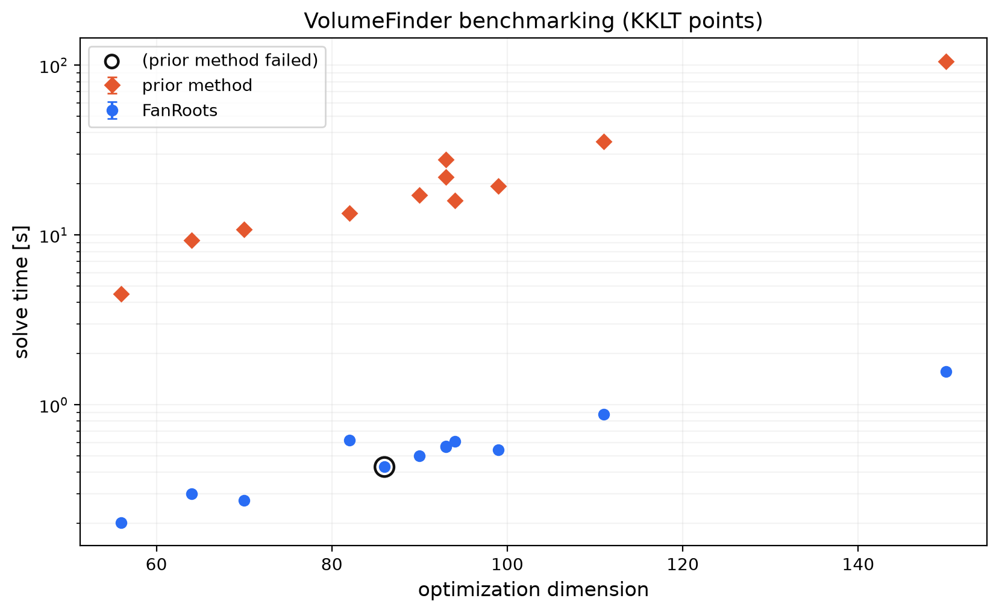

# fanroots
*[Nate MacFadden](https://github.com/natemacfadden), Liam McAllister Group, Cornell*

Root-finding and optimization for vector-valued functions defined piecewise over the secondary fan of a point or vector configuration. Designed for Kähler moduli stabilization (KMS) in string compactifications, where it delivers **order-of-magnitude speedups** over prior methods (i.e., those in [arXiv:2406.13751](https://arxiv.org/abs/2406.13751)).

## The Problem

Given a vector/point configuration with $N$ elements, the secondary fan partitions $\mathbb{R}^N$ (or, for vector configurations, a convex subregion of this space) into convex 'secondary' cones. Call $\mathbb{R}^N$ 'height space'. This software is designed for continuous, differentiable functions whose analytic form may vary chamber-by-chamber. One example is K\"ahler moduli stabilization, which depends on the intersection numbers of the toric variety associated to each triangulation. These numbers change discretely as one crosses walls of the secondary fan, but the function remains smooth.

The major complication in practice is the moderate-to-high dimension $\mathbb{R}^N$ ($N\approx 200$) as well as the large number of chambers (depending roughly exponentially on N - see [arXiv:2008.01730](https://arxiv.org/abs/2008.01730), [arXiv:2309.10855](https://arxiv.org/abs/2309.10855), and [arXiv:2602.16909](https://arxiv.org/abs/2602.16909)). At $N$ of interest, there are far too many chambers to enumerate, so operations are instead taken locally.

## Algorithm

**fanroots** solves this by moving through the fan adaptively:

- **Large steps** (`JumpStep`): jump directly to target heights, recomputing the triangulation from scratch. Effective when the function varies slowly chamber-by-chamber, as is typical for finding locations in Kähler moduli space where the divisors take certain volumes.
- **Small steps** (`FlopStep`): walk along the step direction via CYTools' `flop_linear` -- a wrapper of `regfans`' flip routines that additionally tracks intersection numbers -- flipping through chamber walls one at a time. Efficient for fine-grained convergence once near a solution.

A schedule can mix both strategies dynamically based on step size. Step proposals include Newton's method, Gauss-Newton, gradient descent, and Levenberg-Marquardt. Step sizes are tuned via backtracking line search, ternary search, or 'shrinking'.

For functions depending on the intersection numbers, performance is further boosted by a recently developed fast intersection number kernel in [CYTools](https://github.com/LiamMcAllisterGroup/cytools), since computation of the intersection numbers typically becomes the bottleneck for such cases.

## Performance

Finding KKLT points (see [arXiv:2406.13751](https://arxiv.org/pdf/2406.13751)), FanRoots is both faster and more robust than the prior method. Across geometries of optimization dimension ($h^{1,1}$) 56-150, it solves in well under 2 s while the prior method takes seconds to minutes -- a **~20-70x speedup that grows with dimension** -- and on some geometries the prior method fails to converge where FanRoots succeeds (ringed below). Times are means over repeated runs with BLAS threads pinned (the prior method's BLAS calls oversubscribe otherwise; see [`benchmarks/`](benchmarks/)).



Each marker is a single Calabi-Yau geometry with its own KKLT point; see [`benchmarks/`](benchmarks/) for the harness, data, and full table.

## Installation

fanroots builds on [CYTools](https://github.com/LiamMcAllisterGroup/cytools): its `cytools.vector_config` module supplies the `VectorConfiguration`/`Fan` types fanroots operates on (these wrap `regfans`' flip/flop routines, adding toric capabilities). CYTools is conda-based and pulls in dependencies that aren't pip-installable on their own (pplpy, normaliz, python-flint, regfans). The provided `environment.yml` creates a conda environment with that full stack (this is the same setup CI uses); then install fanroots into it with pip:

```
conda env create -f environment.yml
conda activate fanroots
pip install -e .
```

## Usage

The primary interface is `FanRoots`, which root-finds a vector-valued function over the secondary fan. Its built-in application `VolumeFinder` solves the divisor-volume problem -- finding Kähler parameters whose divisor volumes match a target. This runs one of the benchmark geometries (see `benchmarks/`):

```python
import sys
sys.path.insert(0, "benchmarks")

import numpy as np
from cytools import Polytope
from fanroots.applications.volume_finder import VolumeFinder
from data import PROBLEMS

# A real benchmark geometry with its target divisor volumes (see benchmarks/).
prob = PROBLEMS[1]
vc = Polytope(prob["points"]).vc(include_points_interior_to_facets=False)
vc._gale_basis = np.asarray(prob["basis"])  # pin the basis (cytools' default is system-dependent)

vf = VolumeFinder(target=np.asarray(prob["target"], dtype=float), vc=vc)
vf.optimize()
print(vf.finished_reason)  # -> "converged"
```

Key arguments (see `help(FanRoots)` for the full list):

| Argument | Options | Description |
|---|---|---|
| `step_proposal` | `"newton"`, `"gauss_newton"`, `"grad"`, `"lma"` | Step direction method (`"newton"` aliases `"gauss_newton"` here) |
| `step_size_optimizer` | `"shrink"`, `"bls"`, `"ternary"`, `"naive"` | Step size tuning |
| `step_taking_method` | `"jump"`, `"flop"` | How to move through the fan; overridden by `step_taking_schedule` for mixed strategies |
| `learning_rate` | float | Scales the proposed step before size optimization |
| `tolerance` | float | Halt when `\|fct(h)\|_2 < tolerance` |
| `min_step_size` | float | Halt if step shrinks below this |
| `verbosity` | int | Controls diagnostic output |

See `fanroots/applications/volume_finder.py` for the `VolumeFinder` implementation, and as a template for defining your own `fct`/`jac`.

## Organization

```
fanroots/
├── fanroots/
│   ├── fanroots.py        # the FanRoots optimizer class
│   ├── step_proposal/     # step directions: newton, gauss_newton, gradient_descent, lma
│   ├── step_size/         # step-size tuning: shrink, backtracking_line_search, ternary, naive
│   ├── step_taking/       # moving through the fan: jump (recompute) vs flop (walk via flips)
│   └── applications/      # volume_finder.py: Kahler parameters for target divisor volumes
├── benchmarks/            # speedup vs the prior method (data.py, prior_method.py, bench_*.py)
├── tests/
│   └── test_volume_finder.py
├── environment.yml
├── pyproject.toml
└── LICENSE
```

## License

[GPLv3](LICENSE). Copyright (c) 2026 Nate MacFadden.
